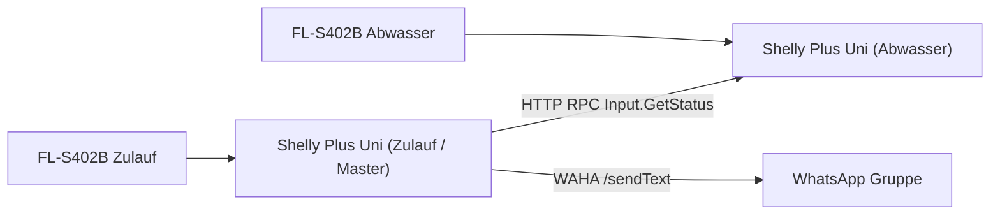

# Schaltplan Shelly Osmose

## Komponenten

- 2x Shelly Plus Uni
- 2x DIGTEN / FL-S402B (Hall-Flow Sensor)
- Netzteil passend fuer Shelly + Sensoren (z. B. 12V DC)

## Sensorbelegung FL-S402B

- `Rot` -> VCC
- `Schwarz` -> GND
- `Gelb` -> Signal (Pulse)

## Logik

- Shelly A (Zulauf) ist Master
- Shelly B (Abwasser) liefert nur Messwert
- Master zieht per RPC den `Input.GetStatus` von Shelly B
- Produktwasser = Zulauf - Abwasser

## Verdrahtung (pro Sensor/Shelly)

1. Sensor `Rot` auf passende Versorgung (+)
2. Sensor `Schwarz` auf GND
3. Sensor `Gelb` auf `Count IN` des zugeordneten Shelly Plus Uni
4. Gemeinsame Masse sicherstellen (gleiche GND-Referenz)

## Uebersicht als Diagramm

## Wichtige Shelly-Einstellungen

- Beide Counter-Inputs auf `count`
- Beide mit Umrechnung:
  - `xcounts.expr = x/1380`
  - `xcounts.unit = Liter`
- Master-Script nur auf Zulauf-Shelly aktivieren
